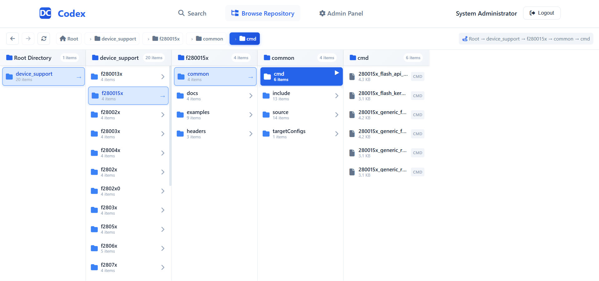
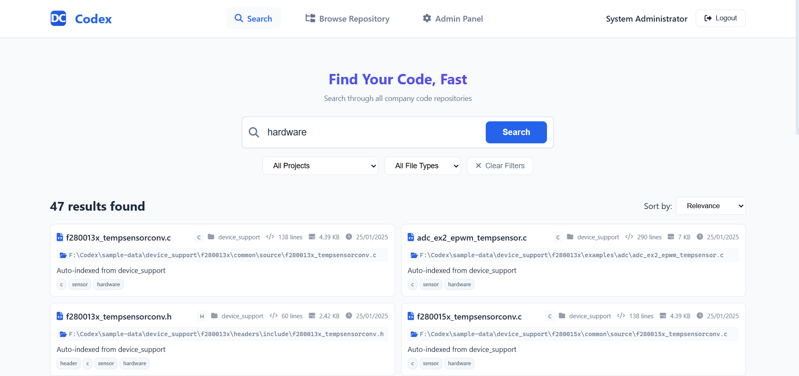
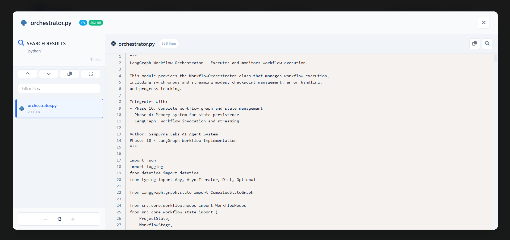
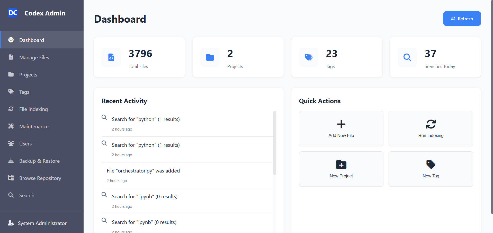

# DC Codex - Internal Code Search System

<p align="center">
  
</p>

<p align="center">
  <strong>A powerful, Google-like search system for code repositories</strong><br>
  Find and reuse code instantly with syntax highlighting, file preview, and smart search
</p>

<p align="center">
  <a href="#features">Features</a> •
  <a href="#screenshots">Screenshots</a> •
  <a href="#demo">Live Demo</a> •
  <a href="#installation">Installation</a> •
  <a href="#tech-stack">Tech Stack</a>
</p>

---

## 📸 Screenshots

<table>
  <tr>
    <td width="50%">
      
      <p align="center"><strong>Repository Browser</strong></p>
    </td>
    <td width="50%">
      
      <p align="center"><strong>Search Interface</strong></p>
    </td>
  </tr>
  <tr>
    <td width="50%">
      
      <p align="center"><strong>IDE-like File Preview</strong></p>
    </td>
    <td width="50%">
      
      <p align="center"><strong>Admin Panel</strong></p>
    </td>
  </tr>
</table>

---

## 🚀 Features

### For Developers
- **Instant Search**: Lightning-fast full-text search across all company code
- **Smart Suggestions**: Auto-complete search suggestions as you type
- **IDE-like File Preview**: View code with syntax highlighting, line numbers, and search within file
- **Code Beautifier**: Automatically formats minified JS/CSS files for readability
- **Repository Browser**: Navigate your codebase with a column-based file explorer
- **Advanced Filters**: Filter by project, file type, or tags
- **Keyboard Shortcuts**: Navigate files quickly (ESC, F11, Ctrl+/- for font size)
- **Real-time Results**: See results instantly as you search

### For Administrators
- **Easy File Management**: Add, edit, and organize files through a simple interface
- **Project Organization**: Group files into projects
- **Tag System**: Create and manage tags for better categorization
- **Automatic Indexing**: Scan and index entire directories with one click
- **User Management**: Control access with role-based permissions
- **Search Analytics**: Track what developers are searching for

### File Preview Features
- **Syntax Highlighting**: Support for 30+ languages (Python, JavaScript, C/C++, Java, etc.)
- **Line Numbers**: Easy code navigation with clickable line numbers
- **Font Size Control**: Adjustable font size (Ctrl+/-)
- **Search in File**: Find text within the currently viewed file
- **Copy to Clipboard**: One-click copy of entire file content
- **File Navigation**: Navigate between files in search results or folders
- **PDF Viewer**: Inline PDF document viewing
- **Image Preview**: View images directly in the browser

## 🛠 Tech Stack

| Category | Technology |
|----------|------------|
| Backend | Python 3.11, Flask, SQLAlchemy |
| Database | PostgreSQL |
| Frontend | HTML5, CSS3, JavaScript |
| Syntax Highlighting | Prism.js (30+ languages) |
| Deployment | Render.com |

---

## 🌐 Deploy to Render.com (Free)

[](https://render.com/deploy)

### Quick Deploy Steps:

1. **Fork this repository** to your GitHub

2. **Go to [render.com](https://render.com)** → Sign up with GitHub

3. **Create PostgreSQL Database**:
   - New → PostgreSQL → Name: `codex-db` → Create (Free tier)
   - Copy the **Internal Database URL**

4. **Create Web Service**:
   - New → Web Service → Connect your forked repo
   - Settings:
     - **Build Command**: `pip install -r requirements.txt`
     - **Start Command**: `gunicorn --chdir backend app:app`
   - Environment Variables:
     ```
     DATABASE_URL = [paste Internal Database URL]
     SECRET_KEY = your-secret-key-here
     CODE_REPOSITORY_PATH = /opt/render/project/src/sample-data
     ```

5. **Done!** Your app will be live at `https://your-app.onrender.com`

---

## 💻 Local Installation

### Prerequisites
- Python 3.8+
- PostgreSQL 12+

### Quick Setup
   ```bash
   git clone https://github.com/om-jasani/codex.git
   cd codex
   ```

2. **Configure environment**:
   ```bash
   cp .env.example .env
   # Edit .env with your database credentials and settings
   ```

3. **Run deployment script**:
   
   **Windows:**
   ```batch
   deploy.bat
   ```
   
   **Linux/macOS:**
   ```bash
   chmod +x deploy.sh
   ./deploy.sh
   ```

   This will:
   - Create a Python virtual environment
   - Install all dependencies
   - Set up the PostgreSQL database
   - Create an admin user

4. **Start the application**:
   
   **Windows (PowerShell):**
   ```powershell
   .\run.ps1
   ```
   
   **Linux/macOS:**
   ```bash
   python backend/app.py
   ```

5. **Access the application**:
   - Open `http://localhost:5000`
   - Login: `admin` / `admin123`

---

## 🗂 Project Structure

```
codex/
├── backend/           # Flask API
│   └── app/
│       ├── api/       # REST endpoints
│       ├── models/    # Database models
│       └── services/  # Business logic
├── frontend/          # Web interface
│   ├── browse.html    # File browser
│   ├── index.html     # Search page
│   └── public/        # CSS, JS, images
├── sample-data/       # Demo code files
└── requirements.txt   # Dependencies
```

## ⌨️ Keyboard Shortcuts

| Shortcut | Action |
|----------|--------|
| `ESC` | Close file preview |
| `F11` | Toggle fullscreen |
| `Ctrl + +/-` | Adjust font size |
| `Ctrl + F` | Search in file |
| `↑` / `↓` | Navigate files |

---

## 📝 License

MIT License - feel free to use for your own projects!

## 👤 Author

**Om Jasani**
- GitHub: [@om-jasani](https://github.com/om-jasani)

---

<p align="center">
  ⭐ Star this repo if you find it useful!
</p>

